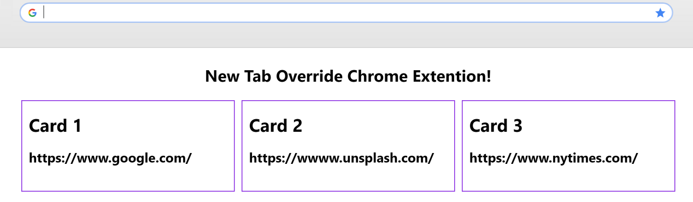

# Chrome New Tab Override Boilerplate

### What is this?

A boilerplate code for a simplistic new-tab-override-extension for Chrome browser to spare you the setup.
Just run `npm run build` and start editting
newtab.html file generated in the _dist_ folder

### Building

`npm run prebuild` : removes dist folder
`npm run postbuild` : copies manifest.json file into dist
`npm run build` : outputs static files to _dist_ folder (if it doesn't exist); runs prebuild + build + postbuild commands

### Installation

- In Chrome navigate to the extensions page [chrome://extensions/](chrome://extensions/)
- Click Load unpacked and choose _dist_ folder
- Open a new tab and you should see the new tab override

### Development

`npm run dev` will build, watch and serve the files at [http://localhost:1234](http://localhost:1234)

Thanks for [Nikita Landin](https://www.iconfinder.com/NikWB) for using his [icon](https://www.iconfinder.com/icons/4584654/browser_chrome_logo_media_network_social_web_icon) for this demo
